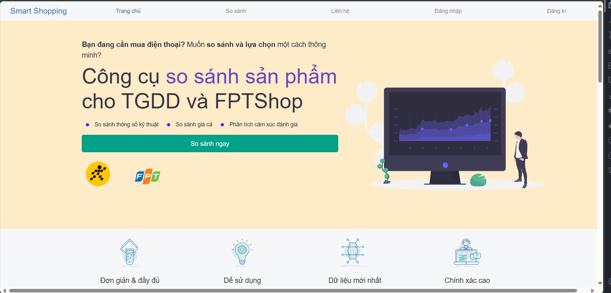
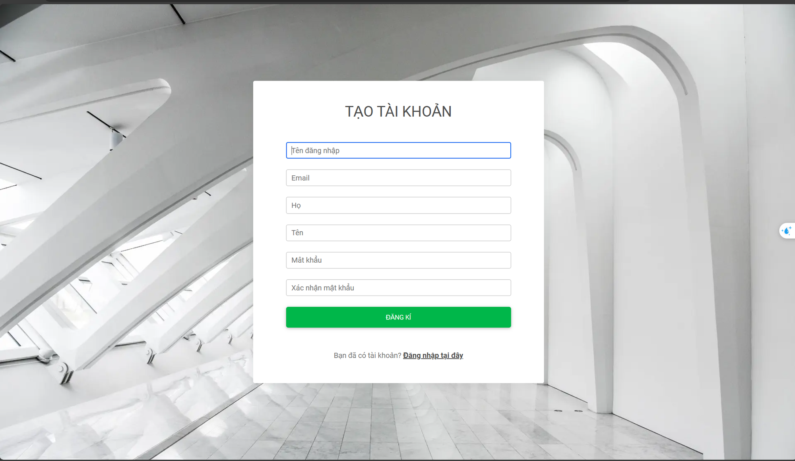
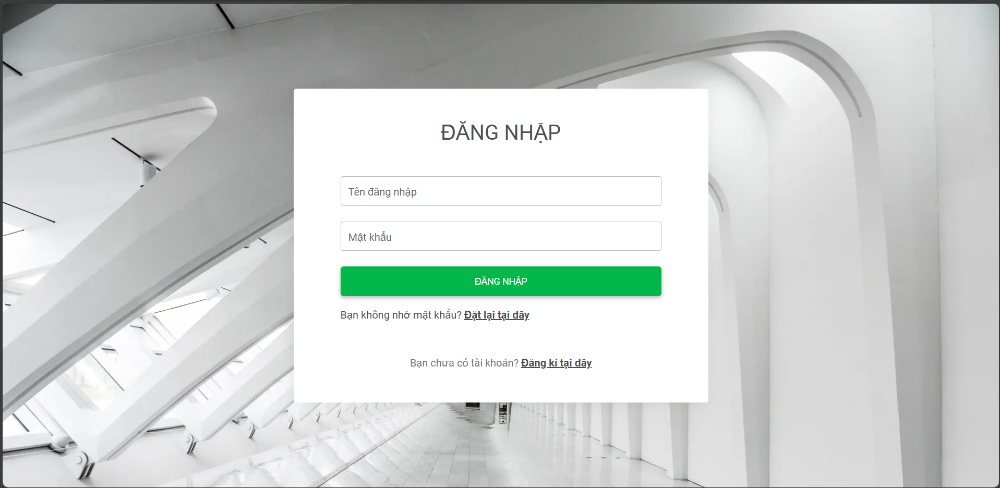
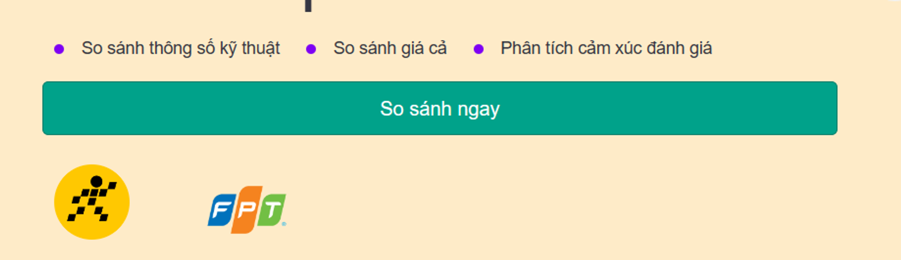
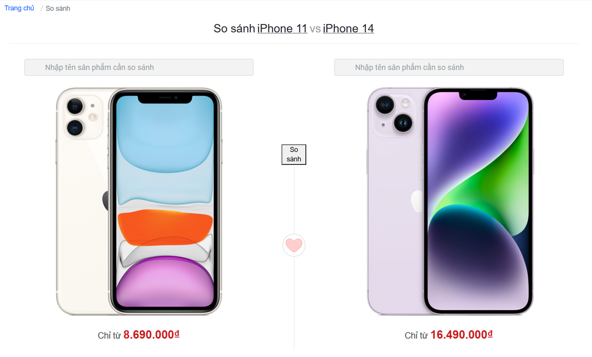
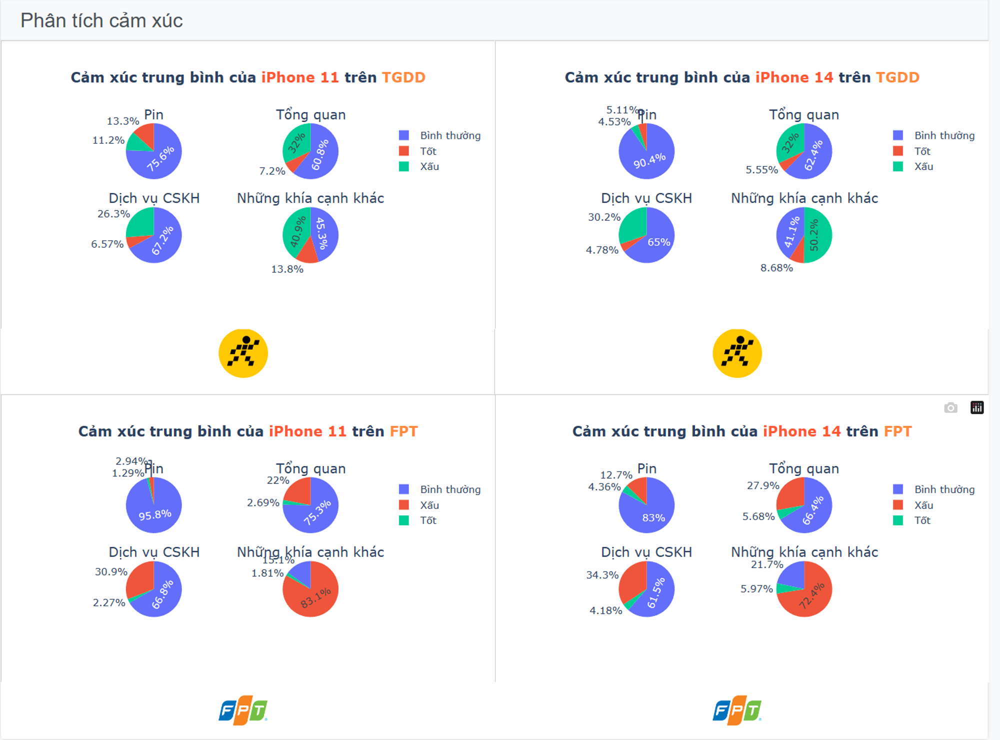

# Xây dựng WEB mua sắm điện thoại thông minh (Smartphone) sử dụng Django Framework 

## Thực trên trên 2 trang web thương mại điện tử lớn tại Việt Nam: Thế giới di động và FPT Shop.

## Báo cáo dự án: [Notion](https://ionized-skateboard-f1a.notion.site/T-i-li-u-h-th-ng-Web-So-S-nh-Gi-ae2c99f60bdb4289966a2f170e1873f5)

## Hướng Dẫn Cài Đặt
```bash
git clone <url>
pip install -r requirements.txt
cd Smart_shopping
python manage.py runserver
```

## Giao diện Website

### Giao diện trang chủ


## Giao diện đăng kí


## Giao diện đăng nhập


## Hướng dẫn cách sử dụng tính năng chính: So sánh, phân tích đánh giá

### So sánh giá


### So sánh iPhone 11 và iPhone 14


### Phân tích đánh giá
